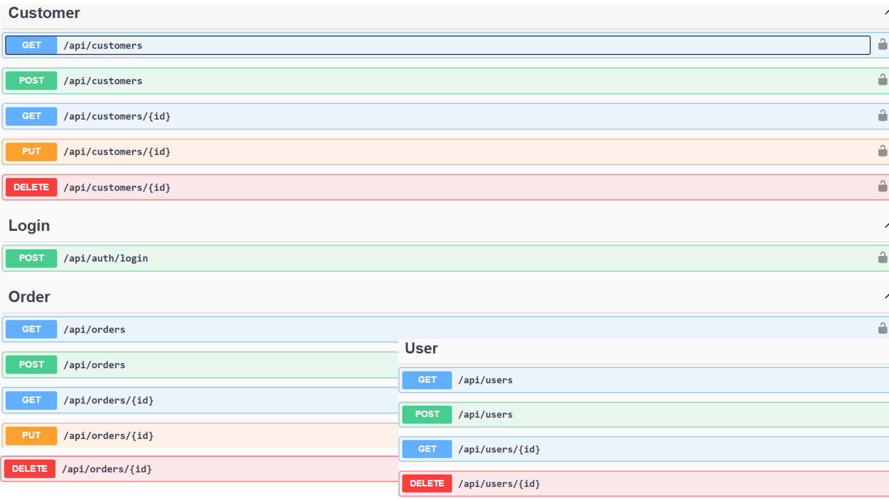

# 🛍️ Order API — .NET 8 RESTful Service

> **Order, customer, and user management system built with Clean Architecture and JSON file persistence.**

[](https://dotnet.microsoft.com/)
[](https://docs.microsoft.com/en-us/dotnet/csharp/)
[](https://swagger.io/)
[](https://www.json.org/)

---

## 📌 Overview

**Order API** is a backend Web API application built with **.NET 8** that provides a complete system for managing customers, orders, and users.

The project follows **Clean Architecture** principles (a clear separation between the API, Business Logic, Data Layer, and Models layers) and uses a persistence system based on **JSON files**, making it lightweight and ready to run without the need to set up an external SQL database.

---

## ✨ Key Features

* **🔐 Security & Authentication:** Access management with **Basic Authentication** implementation.
* **👥 Customer Management:** Full CRUD for customer records and management.
* **📦 Order Management:** Creation, tracking, updating, and deletion of orders.
* **👤 User Management:** Administration of system users and credentials.
* **💾 File-Based Persistence:** Data storage structured on local JSON files using the Repository and DTO patterns.
* **📑 Interactive API Documentation:** Endpoint documentation and exploration integrated with **Swagger / OpenAPI**.

---

## 📷 Screenshot



---

## 🏗️ Project Architecture

The project follows a strict modular structure:

```text
Esame_OrderAPI/
├── Esame_OrderAPI/       # API Layer (Controllers, Security, Middleware, Program.cs)
├── OrderAPI.BL/          # Business Logic Layer (Services, Logic)
├── OrderAPI.DL/          # Data Access Layer (Repositories, File I/O)
└── OrderAPI.Models/      # Domain Layer (Entities, DTOs, Enums, Configurations)
```

---

## 📖 API Documentation & Endpoints

All endpoints are documented and testable through the **Swagger UI** interface at:

`http://localhost:5001/swagger`

### 🔐 Authentication

| Method | Endpoint | Description |
| --- | --- | --- |
| `POST` | `/api/login` | User authentication |

### 👥 Customers

| Method | Endpoint | Description |
| --- | --- | --- |
| `GET` | `/api/customers` | Get the full list of customers |
| `GET` | `/api/customers/{id}` | Get details of a specific customer |
| `POST` | `/api/customers` | Register a new customer |
| `PUT` | `/api/customers/{id}` | Update a customer's data |
| `DELETE` | `/api/customers/{id}` | Delete a customer |

### 📦 Orders

| Method | Endpoint | Description |
| --- | --- | --- |
| `GET` | `/api/orders` | List of all orders |
| `GET` | `/api/orders/{id}` | Single order details |
| `POST` | `/api/orders` | Create a new order |
| `PUT` | `/api/orders/{id}` | Update an existing order |
| `DELETE` | `/api/orders/{id}` | Delete an order |

### 👤 Users

| Method | Endpoint | Description |
| --- | --- | --- |
| `GET` | `/api/users` | List of system users |
| `GET` | `/api/users/{id}` | User details |
| `POST` | `/api/users` | Register a new user |
| `PUT` | `/api/users/{id}` | Update a user |
| `DELETE` | `/api/users/{id}` | Remove a user |

---

## 🚀 Getting Started

### Prerequisites

* [.NET 8 SDK](https://dotnet.microsoft.com/download/dotnet/8.0) or later
* Visual Studio 2022 / VS Code / JetBrains Rider

### Build & Run

1. **Clone the repository:**

```bash
git clone <repository-url>
cd OrderAPI
```

2. **Build the project:**

```bash
dotnet build
```

3. **Run the application:**

```bash
dotnet run --project Esame_OrderAPI/Esame_OrderAPI.csproj
```

4. Navigate to `http://localhost:5001/swagger` in your browser to test the endpoints.

---

## ⚙️ Data Configuration

Data is stored locally in the `Esame_OrderAPI/Data/` folder, in the following files:

* `CustomersFile.json`
* `OrdersFile.json`
* `UserFile.json`

---

**Developed by [Jacopo Russo](https://github.com/Pino0511)**
