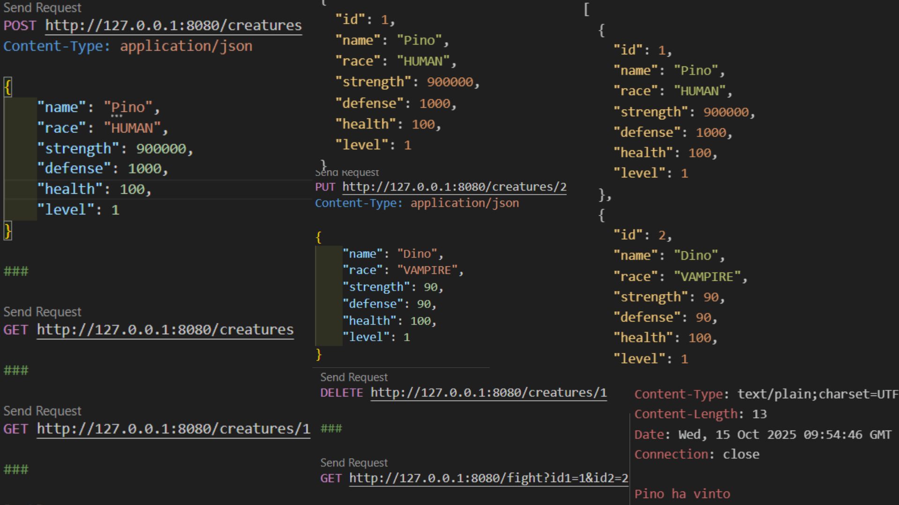

# War of Races

A Spring Boot application for managing creatures and races in a fantasy battle system.

## Application Overview

This application provides a REST API for managing fantasy creatures and races. Key features include:

### Creatures

- Create, read, update and delete creatures
- Each creature has:
  - Name
  - Race type
  - Health points
  - Attack power
  - Defense stats
  - Special abilities

### Races

- Predefined race types (e.g. Elf, Dwarf, Orc)
- Each race has unique characteristics
- Race-specific bonuses and penalties

### Battle System

- Simulate battles between creatures
- Calculate damage based on:
  - Attack power
  - Defense stats
  - Race bonuses
  - Special abilities

### API Endpoints

- `/api/creatures` - Creature management
- `/api/races` - Race information
- `/api/battles` - Battle simulation

## Screenshot



## Project Structure

```
warofraces/
├── src/
│   ├── main/
│   │   ├── java/
│   │   │   └── dev/russojacopo/warofraces/
│   │   └── resources/
│   └── test/
│       └── java/
│           └── dev/russojacopo/warofraces/
```

## Prerequisites

- Java 11 or higher
- Maven 3.6.x or higher

## Getting Started

1. Clone the repository

   `git clone <repo-url>`

2. Navigate to the project directory

   `cd warofraces`

3. Build the project

   `./mvnw clean install`

4. Run the application

   `./mvnw spring-boot:run`

The application will start on `http://localhost:8080`

## API Documentation

API documentation is available at `http://localhost:8080/swagger-ui.html` when the application is running.

## Testing

To run the tests:

`./mvnw test`

## Built With

- Spring Boot
- Maven
- Java

## License

This project is licensed under the MIT License - see the LICENSE file for details.

## ❓ Troubleshooting

### Application won't start
- Ensure Java 11+ is installed: `java -version`
- Check that port 8080 is not in use
- Try cleaning and rebuilding: `./mvnw clean install`
- Verify Maven is properly installed: `mvn --version`

### Swagger UI not accessible
- Verify application is running on `http://localhost:8080`
- Check that Spring Boot started successfully (look for "Started" message in logs)
- Clear browser cache and try again
- Check browser console for JavaScript errors (F12)

### Database connection errors
- Verify SQLite database file has proper read/write permissions
- Ensure database path is correctly configured in `application.properties`
- Try deleting the old database file to force recreation
- Check logs for specific database error messages

### API endpoints returning 404
- Verify application is running: `http://localhost:8080`
- Check endpoint paths are exactly as documented
- Ensure request method (GET, POST, etc) is correct
- Check request headers and body format (JSON)

### Maven build failures
- Clean Maven cache: `rm -rf ~/.m2/repository`
- Ensure JDK (not JRE) is installed
- Try rebuilding: `./mvnw clean install -U`
- Check for Java compilation errors in the output

### JSON parsing errors
- Verify request body is valid JSON
- Check all required fields are included
- Ensure field names match exactly (case-sensitive)
- Validate JSON structure using a JSON validator online

### Port 8080 already in use
- Check what process is using port 8080: `lsof -i :8080` (Mac/Linux) or `netstat -ano | findstr :8080` (Windows)
- Kill the process or configure a different port in `application.properties`: `server.port=8081`
- Restart the application
