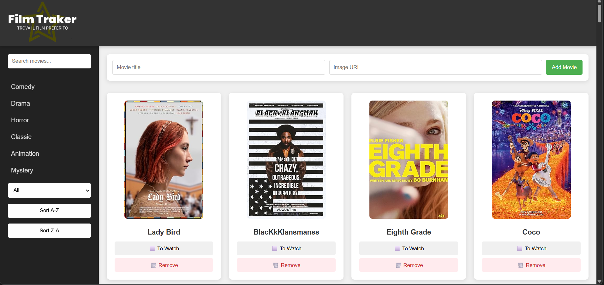

# 🎬 Film Filter App

A simple, responsive web app to browse, filter, and manage a list of movies. Ideal as a static frontend project demonstrating the use of fetch, DOM manipulation, and client-side state handling.

## ✨ Main features

- ✅ Fetch movies by genre from a public API
- 🔍 Search movies by title (live filter)
- 👁️ Mark movies as "seen" / "unseen" (state saved via cookies)
- 🗑️ Remove movies from the list
- ➕ Add custom (temporary) movies
- 🔃 Sort the list A→Z and Z→A
- 💻 Responsive layout for desktop, tablet and mobile
- 🕒 Demonstration feature: automatically removes the first "seen" movie (configurable in the code)

## 📷 Screenshot



## 📦 Stack and dependencies

- HTML5
- CSS3 (responsive layout, custom properties)
- JavaScript (Fetch API, DOM, cookie handling)
- Recommended public API: https://sampleapis.com/api-list/movies

## 🚀 How to run (local)

The app is static — simply open `index.html` or serve the folder with a static server. Examples:

Open directly (file mode):

Windows: open `film-filter-app\\index.html` in your browser.


## 🛠️ Project structure

```
film-filter-app/
	index.html        # entry point
	css/              # styles
		style.css
	js/               # client logic (fetch, filters, cookie)
		main.js
	README.md         # this file
	screenshot.png    # (optional) image used in the Screenshot section
```

## ℹ️ How it works (short)

- API calls fetch movies by genre using query strings (e.g. `?categoria=comedy`)
- Search filters the results already loaded in the DOM without re-calling the API
- The "seen" state is saved in cookies to preserve the preference across reloads
- Manual additions and removals are temporary (local persistence is not implemented in the base project)

## Quick tips & customization

- To change the API or add local persistence, edit `js/main.js` and replace the data source.
- To disable the automatic removal of "seen" movies, find and comment the timer function in the JS file.

## License & credits

Personal project — feel free to copy, modify or use it as a learning base.

