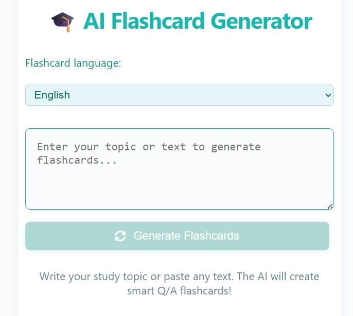
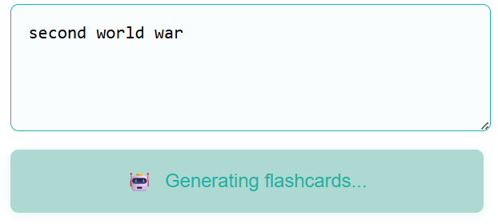
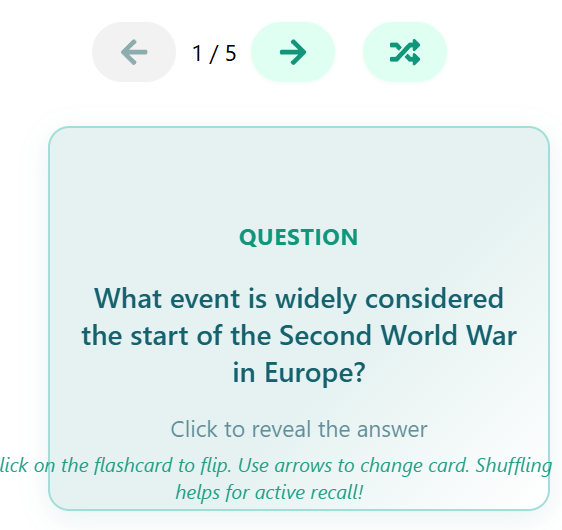
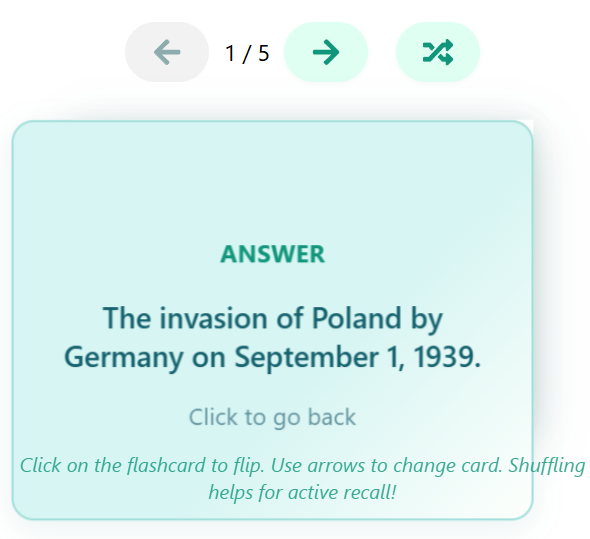

# 🎴 AI Flashcard Generator

> **Intelligent AI-guided study flashcard generation.**

[](https://reactjs.org/)
[](https://flask.palletsprojects.com/)
[](https://www.python.org/)
[](https://openai.com/)

---

## 📌 Overview

**AI Flashcard Generator** is a full-stack web application that leverages language models (OpenAI / Gemini API) to transform complex topics or texts into study-ready educational flashcard decks.

The application combines a lightweight REST API backend in **Flask** for prompt orchestration and JSON structuring with a reactive user interface in **React** featuring animations and interactive study experiences.

---

## ✨ Key Features

* **⚡ Automatic AI Generation:** Instant creation of questions and answers from any topic or text provided by the user.
* **🌐 Multilingual Support:** Ability to generate and study card decks in multiple languages.
* **🔄 Interactive Study Interface:** Smooth navigation and "flip" animation (front/back) for an immersive review experience.
* **🛡️ Robust Validation & Handling:** Management of user input errors, missing API keys, and provider rate limits.

---

## 📸 Screenshots

|  | |
| :---: | :---: |
|  |  |

| | |
| :---: | :---: |
|  |  |

---

## 🛠️ Tech Stack

* **Frontend:** React, JavaScript (ES6+), CSS3
* **Backend:** Python 3.9+, Flask, Flask-CORS
* **LLM Integrations:** OpenAI API / Google Gemini API
* **Configuration:** `python-dotenv`

---

## 🚀 Getting Started

### Prerequisites

* **Node.js** >= 16
* **Python** >= 3.9

---

### 1. Backend Setup (Flask)

```bash
cd backend

# Create and activate the virtual environment
python -m venv venv

# Linux/macOS:
source venv/bin/activate
# Windows:
# venv\Scripts\activate

# Install dependencies
pip install -r requirements.txt

# Create a .env file inside the backend/ folder:
OPENAI_API_KEY=your_openai_key
GEMINI_API_KEY=your_gemini_key
PORT=5000

# Start the API server:
python app.py
```

### 2. Frontend Setup (React)
In a new terminal window:
```bash
cd frontend/flashcard-frontend

# Install dependencies
npm install

# Start the application
npm start
```
