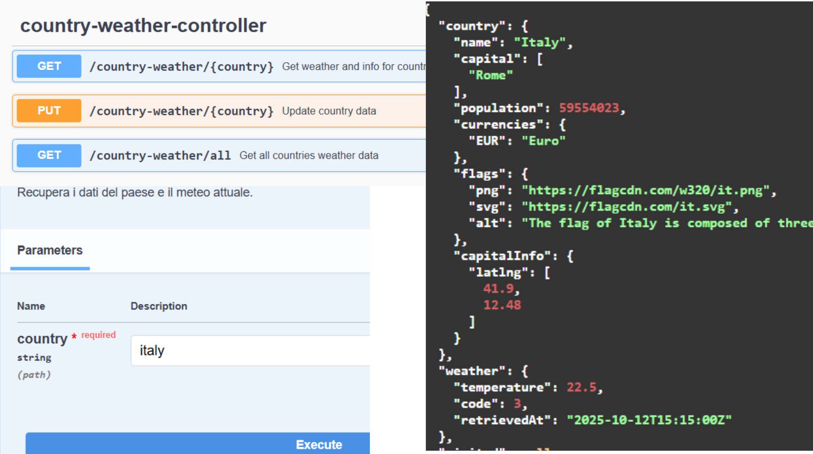

# ☀️ Weather Dashboard

A Spring Boot REST API application for retrieving and managing weather data using the OpenMeteo API with SQLite persistence.

## 📋 Overview

Weather Dashboard is a Spring Boot application that fetches real-time weather data from OpenMeteo API and stores it in a local SQLite database. Built with clean architecture principles and OpenFeign for external API communication.

**Key Features:**
- 🌤️ Real-time weather data retrieval from OpenMeteo API
- 📍 Location-based weather queries
- 💾 SQLite database for data persistence
- 📊 RESTful API with OpenAPI/Swagger documentation
- 🐳 Docker containerization support
- 🔄 Automatic DTO mapping with ModelMapper

---
## Screenshots

---

## 🛠️ Tech Stack

**Key Dependencies:**
- Spring Boot Starter Web
- Spring Boot Starter Data JPA
- Spring Cloud OpenFeign
- Springdoc OpenAPI UI
- SQLite JDBC Driver
- ModelMapper

---
## 📦 Prerequisites

- Java 21 or higher
- Maven 3.6+ (or use included wrapper)
- Docker (optional)

---

## 🚀 Getting Started

### Build and Run

Clone repository
git clone <repository-url>
cd weatherApp

Build project
./mvnw clean install

Run application
./mvnw spring-boot:run

### Access Application

- **Application**: http://localhost:8080
- **Swagger UI**: http://localhost:8080/swagger-ui.html
- **API Docs**: http://localhost:8080/v3/api-docs

---

## 📖 API Documentation

Interactive API documentation available at: http://localhost:8080/swagger-ui.html

**Example Endpoints:**
GET /api/weather/current?lat={latitude}&lon={longitude}
GET /api/weather/forecast?lat={latitude}&lon={longitude}
POST /api/weather/location
GET /api/weather/history

---

## 🐳 Docker

Build image
docker build -t weather-dashboard .

Run container
docker run -p 8080:8080 weather-dashboard

---

## ⚙️ Configuration

Edit `src/main/resources/application.properties`:

server.port=8080
spring.datasource.url=jdbc:sqlite:post.db
spring.jpa.hibernate.ddl-auto=update

---

## 👤 Author

**Jacopo Russo**
- GitHub: [@Pino0511](https://github.com/Pino0511)
- LinkedIn: [Jacopo Russo](https://linkedin.com/in/jacopo-russo)

---

## 🙏 Acknowledgments

- [OpenMeteo API](https://open-meteo.com/) - Weather data provider
- [Spring Boot](https://spring.io/projects/spring-boot)
- [Springdoc OpenAPI](https://springdoc.org/)

