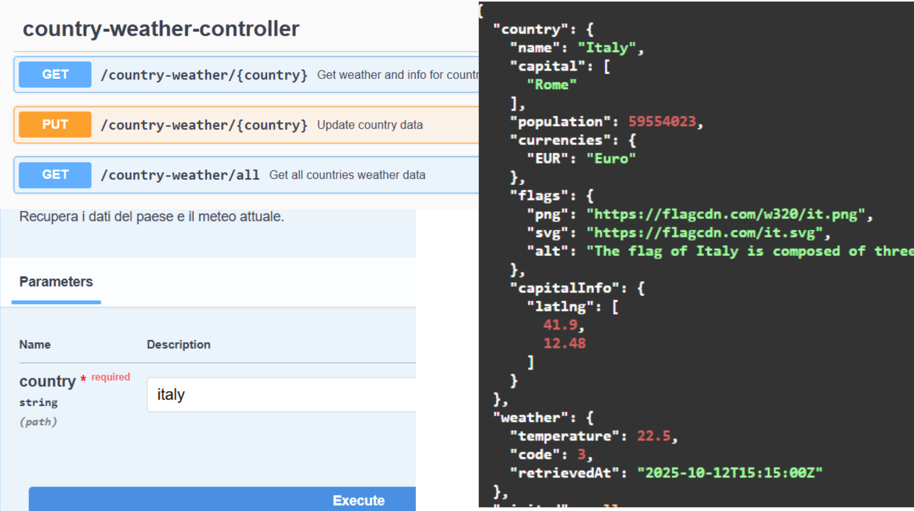

# 🌍 Country Weather Service

Spring Boot REST API that integrates two external services (**REST Countries API** and **OpenMeteo API**) via **Spring Cloud OpenFeign** to retrieve, aggregate, and store geographic information and real-time weather data.

---

## 📋 Overview

The service accepts a country name, retrieves its geographic details (capital, population, currency, flag), extracts the capital's geographic coordinates, and uses them to query the weather service. The aggregated data is persisted to a database via Spring Data JPA to allow subsequent updates (visit status, personal notes, and rating).

## 🌟 Key Features

- 🌍 **Country Data Retrieval**: Extraction of geographic and demographic data from REST Countries API.
- 🌤️ **Real-time Weather**: Weather query based on the capital's coordinates via OpenMeteo API.
- 🔄 **OpenFeign Integration**: Declarative HTTP clients for communication between microservices/external APIs.
- 💾 **Data Persistence**: Saving and processing of aggregated data via Spring Data JPA.
- 📊 **Swagger / OpenAPI 3**: Interactive interface for testing and documenting REST endpoints.

---

## 📸 Demo & Screenshots



---

## 🛠️ Tech Stack


---

## 🚀 Getting Started

### Prerequisites

- **Java 17** or higher
- **Maven 3.6+**
- **Git**

### Configuration

Check the database configuration in the file `src/main/resources/application.properties`:

```properties
spring.datasource.url=jdbc:postgresql://localhost:5432/weather_db
spring.datasource.username=your_username
spring.datasource.password=your_password
spring.jpa.hibernate.ddl-auto=update
```

### Installation & Run

Clone the repository:

```bash
git clone <repository-url>
cd weatherApp
```

Compile and run the application:

On Windows (Command Prompt):

```dos
mvnw spring-boot:run
```

On Linux / macOS / PowerShell:

```bash
./mvnw spring-boot:run
```

Access Swagger UI:

With the application launched on `http://localhost:8080`:

- Swagger UI: `http://localhost:8080/swagger-ui.html`
- API Docs JSON: `http://localhost:8080/v3/api-docs`

---

## 🔗 REST Endpoints

| Method | Endpoint | Description |
|---|---|---|
| GET | `/country-weather/{country}` | Retrieves the country's geographic and weather data, persisting the result to the database. |
| PUT | `/country-weather/{country}` | Update the visit status (`visited`), notes, and rating for the specified country. |
| GET | `/country-weather/all` | Returns the complete list of countries and weather locations saved in the database. |
